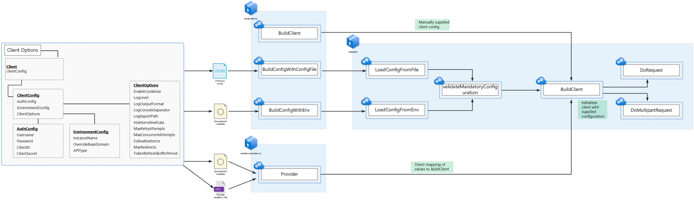

# Go API HTTP Client

This Go module offers a sophisticated HTTP client designed for seamless API interactions, with a strong emphasis on concurrency management, robust error handling, extensive logging, and adaptive rate limiting. It's particularly suitable for applications requiring high-throughput API interactions with complex authentication and operational resilience.

This client leverages API-specific SDKs to provide a comprehensive and consistent interface for interacting with various APIs, including Microsoft Graph, Jamf Pro, and others. It is designed to be easily extensible to support additional APIs and to be highly configurable to meet specific API requirements. It achieves this through using a modular design, with a core HTTP client and API-specific handlers that encapsulate the unique requirements of each API supported.

This HTTP client is intended to be used with targetted SDK's and terraform providers only. As such the http client cannot be used without a supporting SDK.

## Features

- **Comprehensive Authentication Support**: Robust support for various authentication schemes, including OAuth and Bearer Token, with built-in token management and validation.
- **Advanced Concurrency Management**: An intelligent Concurrency Manager dynamically adjusts concurrent request limits to optimize throughput and adhere to API rate limits.
- **Structured Error Handling**: Clear and actionable error reporting facilitates troubleshooting and improves reliability.
- **Performance Monitoring**: Detailed performance metrics tracking provides insights into API interaction efficiency and optimization opportunities.
- **Configurable Logging**: Extensive logging capabilities with customizable levels and formats aid in debugging and operational monitoring.
- **Adaptive Rate Limiting**: Dynamic rate limiting automatically adjusts request rates in response to API server feedback.
- **Flexible Configuration**: Extensive customization of HTTP client behavior to meet specific API requirements, including custom timeouts, retry strategies, header management, and more.
- **Header Management**: Easy and efficient management of HTTP request headers, ensuring compliance with API requirements.
- **Enhanced Logging with Zap**: Utilizes Uber's zap library for structured, high-performance logging, offering levels from Debug to Fatal, including structured context and dynamic adjustment based on the environment.
- **API Handler Interface**: Provides a flexible and extensible way to interact with different APIs, including encoding and decoding requests and responses, managing authentication endpoints, and handling API-specific logic.
- **Configuration via JSON or Environment Variables**: The Go API HTTP Client supports configuration via JSON files or environment variables, providing flexibility in defining authentication credentials, API endpoints, logging settings, and other parameters.

- **Cookie Jar Support**: Incorporates an optional cookie jar to manage cookies effortlessly across requests, enhancing session management and statefulness with APIs that require cookie-based authentication or tracking. This feature allows for automatic storage and sending of cookies with subsequent requests, mirroring browser-like interaction with web services. It can be enabled or disabled based on configuration, providing flexibility in how stateful interactions are handled with the target API.

## API Handler

The `APIHandler` interface abstracts the functionality needed to interact with various APIs, making the HTTP client adaptable to different API implementations. It includes methods for constructing resource and authentication endpoints, marshaling requests, handling responses, and managing API-specific headers.

### Implementations

Currently, the HTTP client supports the following API handlers:

- **Jamf Pro**: Tailored for interacting with Jamf Pro's API, providing specialized methods for device management and configuration.
- **Microsoft Graph**: Designed for Microsoft Graph API, enabling access to various Microsoft 365 services.

## Getting Started

## HTTP Client Build Flow

The HTTP client build flow can be initiated using a number of methods. The primary methods include:

Using the SDK `BuildClientWithConfigFile` function, which reads the configuration from a JSON file and constructs the client accordingly. The configuration file specifies the authentication details, API environment settings, and client options, such as logging level, retry attempts, and concurrency limits.

Or using the SDK `BuildClientWithEnvironmentVariables` function, which reads the configuration from environment variables and constructs the client accordingly. This method allows for more flexible configuration management, particularly in containerized environments or when using orchestration tools.

There is also the option to the build the client manually by creating a new `Client` struct and setting the required fields directly. This method provides the most granular control over the client configuration and can be useful for advanced use cases or when integrating with existing configuration management systems. This is the approached used in related terraform providers.



### Installation

To use this HTTP client in your project, add the package to your Go module dependencies:

```bash
go get github.com/yourusername/go-api-http-client
```

### Usage

Example usage with a configuration file using the jamfpro SDK client builder function:

```go
package main

import (
	"encoding/xml"
	"fmt"
	"log"

	"github.com/deploymenttheory/go-api-sdk-jamfpro/sdk/jamfpro"
)

func main() {
	// Define the path to the JSON configuration file
	configFilePath := "/path/to/your/clientconfig.json"

	// Initialize the Jamf Pro client with the HTTP client configuration
	client, err := jamfpro.BuildClientWithConfigFile(configFilePath)
	if err != nil {
		log.Fatalf("Failed to initialize Jamf Pro client: %v", err)
	}
}

```

Example configuration file (clientconfig.json):

```json
{
  "Auth": {
    "ClientID": "client-id", // set this for oauth2 based authentication
    "ClientSecret": "client-secret", // set this for oauth2 based authentication
    "Username": "username", // set this for basic auth
    "Password": "password" // set this for basic auth
  },
  "Environment": {
    "APIType": "", // define the api integration e.g "jamfpro" / "msgraph"
    "InstanceName": "yourinstance", // used for "jamfpro"
    "OverrideBaseDomain": "", // used for "jamfpro"
    "TenantID": "tenant-id", // used for "msgraph"h
    "TenantName ": "resource", // used for "msgraph"
  },
  "ClientOptions": {
    "Logging": {
      "LogLevel": "LogLevelDebug", // "LogLevelDebug" / "LogLevelInfo" / "LogLevelWarn" / "LogLevelError" / "LogLevelFatal" / "LogLevelPanic"
      "LogOutputFormat": "console", // "console" / "json"
      "LogConsoleSeparator": "  ", // " " / "\t" / "," / etc.
      "LogExportPath": "/your/log/path/folder",
      "HideSensitiveData": true // redacts sensitive data from logs
    },
    "Cookies": {
      "EnableCookieJar": true, // enable cookie jar support
      "CustomCookies": { // set custom cookies as an alternative to cookie jar
        "sessionId": "abc123",
        "authToken": "xyz789"
      }
    },
    "Retry": {
      "MaxRetryAttempts": 5, // set number of retry attempts
      "EnableDynamicRateLimiting": true // enable dynamic rate limiting
    },
    "Concurrency": {
      "MaxConcurrentRequests": 3 // set number of concurrent requests
    },
    "Redirect": {
      "FollowRedirects": true, // follow redirects
      "MaxRedirects": 5 // set number of redirects to follow
    }
  }
}
```


## Reporting Issues and Feedback

### Issues and Bugs

If you find any bugs, please file an issue in the [GitHub Issues][GitHubIssues] page. Please fill out the provided template with the appropriate information.

If you are taking the time to mention a problem, even a seemingly minor one, it is greatly appreciated, and a totally valid contribution to this project. **Thank you!**

## Feedback

Contributions are welcome to make this HTTP client even better! Feel free to fork the repository, make your improvements, and submit a pull request. For major changes or new features, please file an issue or feature request in the [GitHub Issues][GitHubIssues] page to discuss what you would like to change.

## Contribution

If you would like to become an active contributor to this repository or project, please follow the instructions provided in [`CONTRIBUTING.md`][Contributing].

## Learn More

* [GitHub Documentation][GitHubDocs]
* [Azure DevOps Documentation][AzureDevOpsDocs]
* [Microsoft Azure Documentation][MicrosoftAzureDocs]

<!-- References -->

<!-- Local -->
[ProjectSetup]: <https://docs.github.com/en/communities/setting-up-your-project-for-healthy-contributions>
[CreateFromTemplate]: <https://docs.github.com/en/github/creating-cloning-and-archiving-repositories/creating-a-repository-on-github/creating-a-repository-from-a-template>
[GitHubDocs]: <https://docs.github.com/>
[AzureDevOpsDocs]: <https://docs.microsoft.com/en-us/azure/devops/?view=azure-devops>
[GitHubIssues]: <https://github.com/segraef/Template/issues>
[Contributing]: CONTRIBUTING.md

<!-- External -->
[Az]: <https://img.shields.io/powershellgallery/v/Az.svg?style=flat-square&label=Az>
[AzGallery]: <https://www.powershellgallery.com/packages/Az/>
[PowerShellCore]: <https://github.com/PowerShell/PowerShell/releases/latest>

<!-- Docs -->
[MicrosoftAzureDocs]: <https://docs.microsoft.com/en-us/azure/>
[PowerShellDocs]: <https://docs.microsoft.com/en-us/powershell/>
